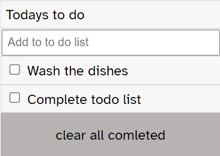

# Project Name

> Todo list with webpack

This is the todo list that I made as a training exercise to create a project page using webpack as overall structure
This 
I used flexbox webpack and offcoure html,css,html

## Built With

- HTML
- CSS
- Nodejs
- NPM
- Webpack

## Live Demo

[Live Demo Link](https://timowest12.github.io/Todo-list/)

## Getting Started

If you want to use this portfolio as a template, you can do so; follow the instructions below.

### Usage

Download it directly by ZIP, open the index file in a text editor, and you can change the content to match your own.

## Authors

👤 **Author1**

- GitHub: [@githubhandle](https://github.com/Timowest12)
- Twitter: [@twitterhandle](https://twitter.com/Timo61060367)
- LinkedIn: [LinkedIn](https://www.linkedin.com/in/timo-wester-6a0282a7/)

## 🤝 Contributing

Contributions, issues, and feature requests are welcome!

Feel free to check the [issues page](../../issues/).

## Show your support

Give a ⭐️ if you like this project!

## 📝 License

This project is [MIT](./MIT.md) licensed.
